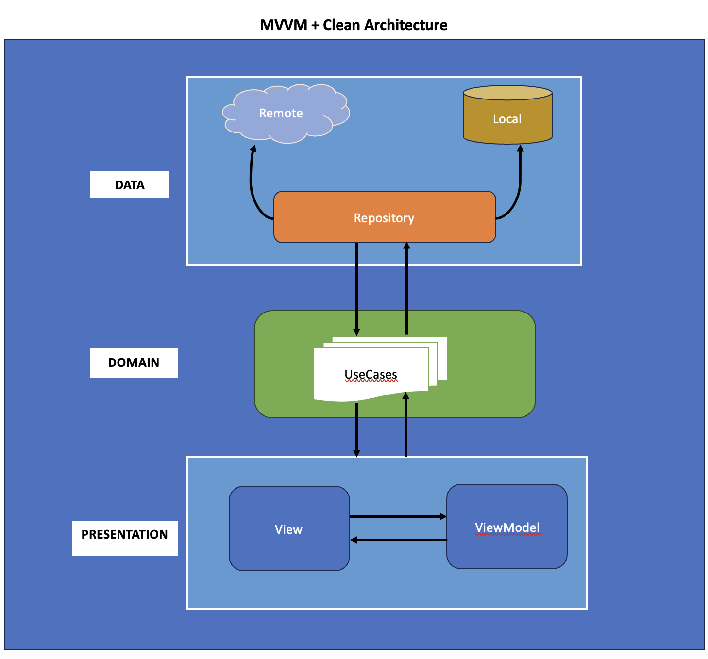

# SmartStream+

A Smart TV streaming app built using Kotlin, leveraging the MVVM architecture pattern and Clean Architecture principles. The app includes features like movie trailer streaming, user profile management, ensuring a scalable, maintainable, and testable codebase.
Real-time data are from the [TMDB.org](https://www.themoviedb.org/).

[//]: # (
)

[//]: # ()

[//]: # ()

[//]: # ()

[//]: # ()

[//]: # ()

[//]: # (
)

## Home Screen

## App Features

## Movie Screen

## Show/TV Series and Search

## Watch Trailer

# [Download APK FILE](https://ksmaprince.github.io/APK/SmartStream.apk)
### Download and install the APK in your Smart TV at home.

# About the Project

SmartStream+ is a sample project showcasing a modern approach to Android Smart TV app development. It integrates widely-used Android tools and demonstrates best practices by leveraging a cutting-edge tech stack, including Jetpack Compose, Kotlin Flow, and Hilt.

## Architecture

The <b>MVVM (Model-View-ViewModel) Clean Architecture</b> pattern has been implemented in this application, with Kotlin as the development language. Clean Architecture promotes separation of concerns, enhancing both maintainability and testability. Integrating MVVM with Clean Architecture organizes the application into distinct layers:

* Presentation Layer
* Domain Layer
* Data Layer

This layered structure simplifies development and testing, making the application more robust and scalable.

## Tech Stacks

- [Kotlin](https://kotlinlang.org/) 100% coverage

- [Jetpack Compose](https://developer.android.com/jetpack/compose)
    - [Material](https://developer.android.com/jetpack/androidx/releases/compose-material) - Build
      Jetpack Compose UIs with ready to use Material Design Components.
    - [Foundation](https://developer.android.com/jetpack/androidx/releases/compose-foundation) - Write
      Jetpack Compose applications with ready to use building blocks and extend foundation to build your
      own design system pieces.
    - [UI](https://developer.android.com/jetpack/androidx/releases/compose-ui) - Fundamental
      components of compose UI needed to interact with the device, including layout, drawing, and input.

    - [Coil-Compose](https://coil-kt.github.io/coil/compose/) - An image loading library support for Compose UI.

- Dependency Injection (DI)
    - [HILT](https://developer.android.com/training/dependency-injection/hilt-android) is used for Dependency Injection as a wrapper on top of [Dagger](https://github.com/google/dagger).

      Most of the dependencies are injected with `@Singleton` scope and are provided within the `NetworkModule.kt`

      For ViewModels, we use the out-of-the-box `@HiltViewModel` annotation.

- Others
    - [Retrofit](https://square.github.io/retrofit/)  for networking
    - [OkHttp-Logging-Interceptor](https://github.com/square/okhttp/blob/master/okhttp-logging-interceptor/README.md)  -
      Logs HTTP request and response data.
    - [Flow](https://developer.android.com/kotlin/flow) - Flows are built on top of coroutines and
      can provide multiple values.
    - [Material Design](https://material.io/develop/android/docs/getting-started/) - Build awesome
      beautiful UIs.
    - [Coroutines](https://github.com/Kotlin/kotlinx.coroutines) - Library Support for
      coroutines,provides runBlocking coroutine builder used in tests.
    - [Kotlin-Serialization](https://kotlinlang.org/docs/serialization.html) - Kotlin Serialization is a powerful, flexible, and efficient library for converting Kotlin objects into a serialized format (e.g., JSON, ProtoBuf) and vice versa.

- Youtube Player (android-youtube-player)
    - [Youtube Player (android-youtube-player)](https://pierfrancescosoffritti.github.io/android-youtube-player/) is a stable and customizable open source YouTube player for Android. It provides a simple View that can be easily integrated in every Activity/Fragment.

# Features
- Upcomming Movies
- Top-Rated Movies
- Now Playing Movies
- See All movies by Category
- UpComming TV Series
- Top-Rated TV Series
- Search Movie
- Profile Management

Developed by [Khun Aung](https://www.khunaung.me/)